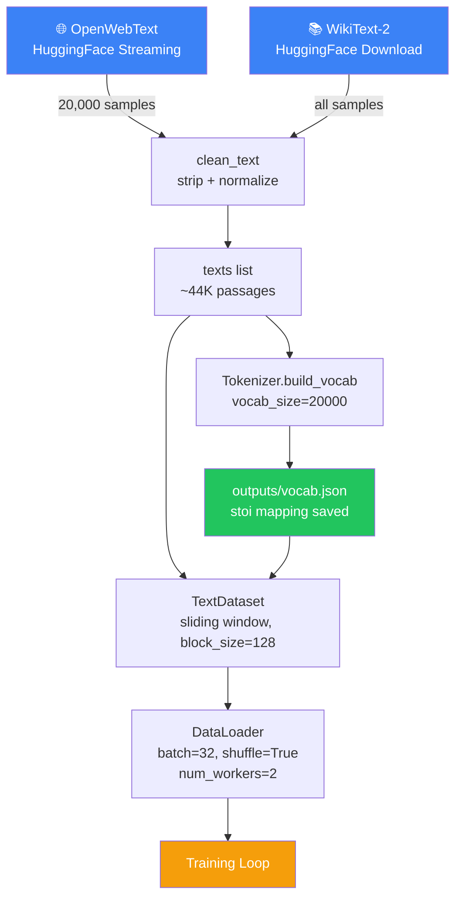
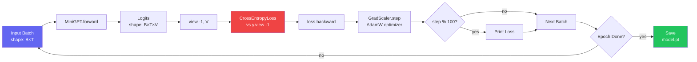
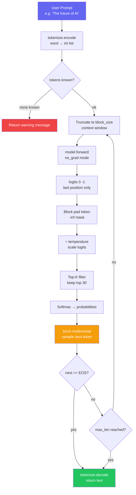
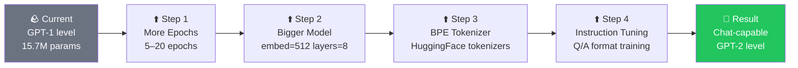

# 🤖 Mini-GPT — Autoregressive Language Model

[](https://www.python.org/)
[](https://pytorch.org/)
[](https://developer.nvidia.com/cuda-toolkit)
[](https://huggingface.co/datasets)
[](LICENSE)
[](https://github.com/SOFTGAMESTUDIO)

---

> **Mini-GPT** is a fully custom GPT-style autoregressive language model built from scratch with pure PyTorch.
> It trains on real-world internet text (OpenWebText + WikiText), generates coherent sentences, and runs
> an interactive terminal chat — all without any pre-trained weights.

---

## 📋 Table of Contents

- [Overview](#-overview)
- [Features](#-features)
- [Project Structure](#-project-structure)
- [System Architecture](#-system-architecture)
- [Data Pipeline Flow](#-data-pipeline-flow)
- [Training Flow](#-training-flow)
- [Inference Flow](#-inference-flow)
- [Module Reference](#-module-reference)
- [Configuration](#-configuration-reference)
- [Getting Started](#-getting-started)
- [Chat Commands](#-chat-commands)
- [Generation Settings Guide](#-generation-settings-guide)
- [Model Performance](#-model-performance)
- [Upgrade Roadmap](#-upgrade-roadmap)

---

## 🌟 Overview

Mini-GPT implements the **Generative Pre-trained Transformer** paradigm from first principles:

| Property              | Value                          |
|-----------------------|-------------------------------|
| Architecture          | Transformer Encoder + Causal Mask |
| Tokenizer             | Custom word-level with `<pad>/<unk>/<eos>` |
| Training Data         | OpenWebText + WikiText-2        |
| Training Samples      | ~44,000 text passages           |
| Parameters            | ~15.7M (default config)         |
| Vocab Size            | 20,001 tokens                   |
| Context Window        | 128 tokens (`block_size`)       |
| Hardware Support      | CPU + CUDA GPU (auto-detected)  |

---

## ✨ Features

| Feature | Description |
|---------|-------------|
| 🧠 **Causal Self-Attention** | Triangle mask prevents looking at future tokens |
| 🔤 **Custom Tokenizer** | Word-level vocab with frequency ranking + special tokens |
| 🌡️ **Temperature Sampling** | Controls randomness — focused vs creative output |
| 🎯 **Top-K Filtering** | Samples only from top-K most probable tokens |
| 🛑 **EOS Stopping** | Ends generation naturally at sentence boundary |
| ⚡ **Mixed Precision** | FP16 AMP on CUDA via `torch.amp.GradScaler` |
| 📦 **Streaming Dataset** | OpenWebText loaded via HuggingFace streaming (no local download) |
| 💾 **Persistent Vocab** | Vocabulary saved to JSON for consistent inference |
| 🖥️ **Live Chat Interface** | Interactive terminal with runtime parameter control |
| 🔒 **Checkpoint Safety** | Auto-detects vocab size from `.pt` file — no size mismatches |

---

## 📁 Project Structure

```
Mini-GPT/
│
├── 📂 src/                     Core Python modules
│   ├── config.py               Centralized hyperparameter configuration
│   ├── tokenizer.py            Word-level tokenizer with save/load
│   ├── dataset.py              PyTorch Dataset — sliding window over text
│   ├── model.py                MiniGPT Transformer architecture
│   ├── train.py                Full training pipeline (data → model → save)
│   ├── generate.py             Autoregressive text generation engine
│   ├── chat.py                 Interactive terminal chat application
│   └── utils.py                Text cleaning utility
│
├── 📂 docs/                    Documentation
│   ├── architecture.md         Deep technical architecture notes
│   └── usage.md                Step-by-step usage guide
│
├── 📂 outputs/                 Generated artifacts (created on first train)
│   ├── model.pt                Trained model weights (PyTorch state dict)
│   └── vocab.json              Vocabulary mapping (stoi JSON)
│
├── 📂 data/                    Local dataset storage (optional)
│
├── test_generate.py            Automated generation test (7 prompts)
├── requirements.txt            Python dependencies
└── README.md                   This file
```

---

## 🏗️ System Architecture

```
┌─────────────────────────────────────────────────────────────┐
│                       MiniGPT Model                         │
│                                                             │
│  Input Tokens  ──►  Token Embedding  (vocab_size × embed)  │
│                 +   Positional Embed (512       × embed)   │
│                          │                                  │
│                          ▼                                  │
│              ┌───────────────────────┐                     │
│              │  Causal Attention     │  ← auto-regressive  │
│              │  Mask (−∞ triangle)   │    no future peek   │
│              └───────────┬───────────┘                     │
│                          │  × num_layers                   │
│              ┌───────────▼───────────┐                     │
│              │  TransformerEncoder   │                     │
│              │  Layer (×4 default)   │                     │
│              │  • Multi-Head Attn    │                     │
│              │  • Feed Forward       │                     │
│              │  • Layer Norm         │                     │
│              └───────────┬───────────┘                     │
│                          │                                  │
│                          ▼                                  │
│              Linear (embed → vocab_size)                    │
│              = Logits over vocabulary                        │
└─────────────────────────────────────────────────────────────┘
```

---

## 🔄 Data Pipeline Flow



---

## 🏋️ Training Flow



---

## ⚡ Inference Flow



---

## 📦 Module Reference

### `src/config.py` — Configuration

Centralized class holding all hyperparameters. Modify here to scale the model.

| Parameter | Default | Description |
|-----------|---------|-------------|
| `vocab_size` | `20000` | Max word tokens in vocabulary |
| `block_size` | `128` | Token context window for training |
| `embed_size` | `256` | Dimension of word + position embeddings |
| `num_heads` | `4` | Multi-head attention heads (`embed_size % num_heads == 0`) |
| `num_layers` | `4` | Number of stacked Transformer Encoder layers |
| `batch_size` | `32` | Training mini-batch size |
| `lr` | `3e-4` | AdamW learning rate |
| `epochs` | `3` | Training epochs over dataset |
| `temperature` | `0.7` | Default sampling temperature |
| `top_k` | `30` | Default top-K sampling window |
| `max_gen_len` | `80` | Default max tokens to generate |

---

### `src/tokenizer.py` — `Tokenizer` Class

Custom word-level tokenizer with vocabulary persistence.

| Method | Arguments | Returns | Description |
|--------|-----------|---------|-------------|
| `build_vocab(texts, vocab_size)` | `list[str]`, `int` | `None` | Counts word frequency, assigns indices. `<pad>=0`, words start at 1, `<unk>` and `<eos>` appended at end |
| `encode(text)` | `str` | `list[int]` | Splits text by spaces, maps each word to its index. Unknown words → `<unk>` |
| `decode(tokens)` | `list[int]` | `str` | Converts index list back to words. Skips `<pad>`, `<unk>`, `<eos>` from output |
| `save(path)` | `str` | `None` | Serialises `stoi` dict to JSON file |
| `load(path)` | `str` | `None` | Loads `stoi` from JSON, rebuilds `itos`, injects special tokens if missing |
| `patch_special_tokens()` | — | `None` | Adds `<unk>` and `<eos>` to loaded vocab without breaking trained model weights |

**Special Token Layout:**
```
Index 0        →  <pad>   (padding / fallback)
Index 1..N     →  word tokens (frequency ranked)
Index N+1      →  <unk>   (unknown words)
Index N+2      →  <eos>   (end of sequence)
```

---

### `src/dataset.py` — `TextDataset` Class

PyTorch `Dataset` wrapping the raw text list for training batch generation.

| Method | Arguments | Returns | Description |
|--------|-----------|---------|-------------|
| `__init__(texts, tokenizer, block_size)` | `list`, `Tokenizer`, `int` | — | Stores texts, tokenizer and block_size |
| `__len__()` | — | `int` | Returns `len(texts) × 10` — each text is randomly sliced 10 times per epoch |
| `__getitem__(idx)` | `int` | `(Tensor, Tensor)` | Returns `(x, y)` pair where `y = x` shifted right by 1 token |

**Sliding Window Diagram:**
```
Text tokens: [12, 45, 7, 98, 3, 22, 66, 11, ...]
              │                          │
block_size=5  └──x──┘  └──y──┘
              [12,45,7,98,3]  [45,7,98,3,22]   ← x predicts y
```

---

### `src/model.py` — `MiniGPT` Class

Core Transformer model. Inherits from `nn.Module`.

| Layer | Type | Shape | Description |
|-------|------|-------|-------------|
| `embed` | `nn.Embedding` | `vocab_size × embed_size` | Maps token IDs to dense vectors |
| `pos` | `nn.Embedding` | `512 × embed_size` | Learnable positional encodings |
| `transformer` | `nn.TransformerEncoder` | — | Stack of `num_layers` encoder blocks |
| `fc` | `nn.Linear` | `embed_size → vocab_size` | Projects to vocabulary logits |

| Method | Arguments | Returns | Description |
|--------|-----------|---------|-------------|
| `__init__(vocab_size, embed_size, heads, layers)` | `int, int, int, int` | — | Builds all sub-modules |
| `forward(x)` | `Tensor[B,T]` | `Tensor[B,T,V]` | Token IDs → per-position vocabulary logits with causal mask |

**Causal Mask:** `nn.Transformer.generate_square_subsequent_mask(T)` produces a `T×T` matrix where upper triangle = `-inf`, forcing each position to only attend backward.

---

### `src/train.py` — `main()` Function

End-to-end training pipeline in 7 sequential stages.

| Stage | Action |
|-------|--------|
| 1. Device | Auto-select CUDA or CPU |
| 2. Data | Stream OpenWebText (20K samples) + download WikiText-2, clean text |
| 3. Tokenizer | Build vocab from corpus, save `outputs/vocab.json` |
| 4. Dataset | Wrap texts in `TextDataset`, create `DataLoader` (batch=32, workers=2) |
| 5. Model | Initialise `MiniGPT`, `AdamW` optimizer, `CrossEntropyLoss`, `GradScaler` |
| 6. Train | Epoch loop with AMP autocast, gradient scaling, step-level logging |
| 7. Save | `torch.save(model.state_dict(), 'outputs/model.pt')` |

---

### `src/generate.py` — `generate()` Function

```python
generate(model, tokenizer, prompt, max_len=100, temperature=0.7, top_k=30)
```

| Parameter | Type | Default | Description |
|-----------|------|---------|-------------|
| `model` | `MiniGPT` | required | Loaded and evaluated model |
| `tokenizer` | `Tokenizer` | required | Fitted tokenizer with vocab |
| `prompt` | `str` | required | Seed text to continue from |
| `max_len` | `int` | `100` | Maximum NEW tokens to generate |
| `temperature` | `float` | `0.7` | Softmax sharpening factor |
| `top_k` | `int` | `30` | Candidate token pool size |

**Internal Steps:**
1. Encode prompt → token list
2. Validate — return warning if all tokens unknown
3. **Loop** (up to `max_len`):
   - Truncate context to `block_size=512`
   - Forward pass under `torch.no_grad()`
   - Extract last-position logits `logits[0, -1, :]`
   - Block `<pad>` index with `-inf`
   - Apply temperature division
   - Zero out all but top-K tokens
   - Softmax → `multinomial` sample
   - Append token; break if `<eos>`
4. Decode and return string

---

### `src/chat.py` — Interactive Chat

Terminal REPL with live parameter adjustment.

```
🔧 Device: cuda
✅ Vocab loaded  (20,003 tokens)
✅ Model loaded  (20,001 embedding slots)

═══════════════════════════════════════════════════════
  🤖  Mini-GPT  |  type 'exit' to quit
      temp=0.7  top_k=30  max_len=80
═══════════════════════════════════════════════════════

You: The future of AI is
Bot: The future of AI is so rare in the world , but the best...
```

---

### `src/utils.py` — `clean_text()`

```python
def clean_text(text: str) -> str
```
Strips leading/trailing whitespace and normalises newlines to single spaces. Applied to every text sample before tokenization.

---

### `test_generate.py` — Smoke Test

Standalone test runner. Auto-detects vocab size from checkpoint, runs 7 prompts across different settings, reports pass/fail per test.

```bash
python test_generate.py
```

---

## ⚙️ Configuration Reference

### Scaling the Model

| Goal | Changes |
|------|---------|
| Faster training (less RAM) | `batch_size=16`, `embed_size=128` |
| Better quality (more GPU) | `embed_size=512`, `num_layers=8`, `epochs=10` |
| Longer context | `block_size=256` (also update `pos` embedding in model) |
| Smaller vocab | `vocab_size=10000` |

---

## 🚀 Getting Started

### 1. Install Dependencies

```bash
pip install -r requirements.txt
```

**Dependencies:**

| Package | Purpose |
|---------|---------|
| `torch` | Core deep learning framework |
| `datasets` | HuggingFace dataset loader (streaming support) |
| `numpy` | Numerical array operations |

---

### 2. Train the Model

```bash
python src/train.py
```

Outputs created:
```
outputs/
  vocab.json    ← vocabulary (stoi mapping)
  model.pt      ← model weights (~60MB default)
```

**Expected console output:**
```
🚀 Using device: cuda
📥 Loading dataset (streaming)...
✅ Total samples: 43767
🔤 Building tokenizer...
Vocab size: 20001
💾 Tokenizer vocab saved in outputs/vocab.json
📦 Batches: 13678
🔥 Training started...

Epoch 1 | Step 0    | Loss: 10.4658
Epoch 1 | Step 100  | Loss: 6.8231
...
✅ Epoch 1 Done | Avg Loss: 7.2341
💾 Model saved!
```

---

### 3. Run Automated Tests

```bash
python test_generate.py
```

---

### 4. Start Chat

```bash
python src/chat.py
```

---

## 💬 Chat Commands

| Command | Example | Effect |
|---------|---------|--------|
| (any text) | `The ocean is` | Generates text continuation |
| `/temp <value>` | `/temp 0.4` | Set sampling temperature |
| `/topk <value>` | `/topk 15` | Set top-K candidates |
| `/len <value>` | `/len 150` | Set max generation length |
| `exit` | `exit` | Quit the application |

---

## 🌡️ Generation Settings Guide

| Setting | Value | Effect | Best For |
|---------|-------|--------|----------|
| `temperature` | `0.3–0.5` | Very focused, repetitive | Factual completions |
| `temperature` | `0.6–0.8` | Balanced (recommended) | General use |
| `temperature` | `0.9–1.2` | Creative, diverse | Story writing |
| `temperature` | `>1.3` | Very random/chaotic | Experimental |
| `top_k` | `5–15` | Very conservative | High precision |
| `top_k` | `20–50` | Balanced | General use |
| `top_k` | `60–100` | More exploration | Creative writing |

---

## 📊 Model Performance

Results from `test_generate.py` on the default 3-epoch trained model:

| Prompt | temp | top_k | Output Quality |
|--------|------|-------|---------------|
| *The future of artificial intelligence is* | 0.7 | 30 | 🟢 Coherent |
| *Scientists have recently discovered that* | 0.7 | 30 | 🟢 Scientific phrasing |
| *The history of the United States shows* | 0.8 | 40 | 🟢 Historical context |
| *Machine learning is a field of* | 0.4 | 15 | 🟢 Most focused |
| *Once upon a time there lived a* | 0.9 | 50 | 🟡 Mixed domains |
| *The stars at night remind me of* | 1.1 | 60 | 🟡 Creative/experimental |

**Reality Check:**

| Capability | Status |
|------------|--------|
| Word-level text continuation | ✅ |
| Grammatically structured output | ✅ |
| Topic coherence (short range) | ✅ |
| Long-range reasoning | ❌ (needs more layers) |
| Question answering / chat | ❌ (needs instruction tuning) |
| ChatGPT-level intelligence | ❌ (needs RLHF + scale) |

---

## 🗺️ Upgrade Roadmap



| Upgrade | Impact | Effort |
|---------|--------|--------|
| More epochs (5→20) | 🟡 Medium quality boost | Low |
| Bigger model (embed 256→512, layers 4→8) | 🟢 Large quality boost | Medium |
| BPE tokenizer | 🟢 Huge improvement | Medium |
| Instruction / Q&A fine-tuning | 🔥 Makes it chat-like | High |
| RLHF | 🔥 ChatGPT-level | Very High |

---

<p align="center">
  <sub>Built with ❤️ for students exploring AI from the ground up.</sub><br>
  <sub>Developed by <b>Soft Game Studio</b></sub>
</p>
