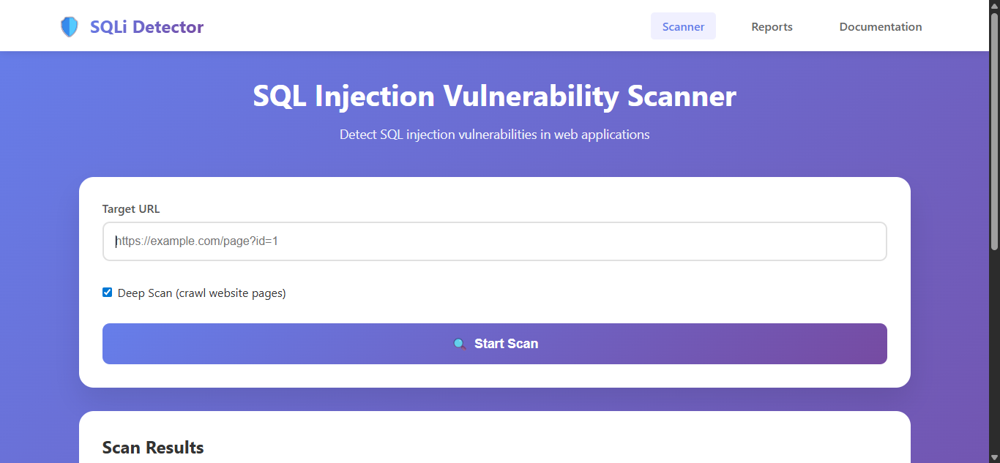
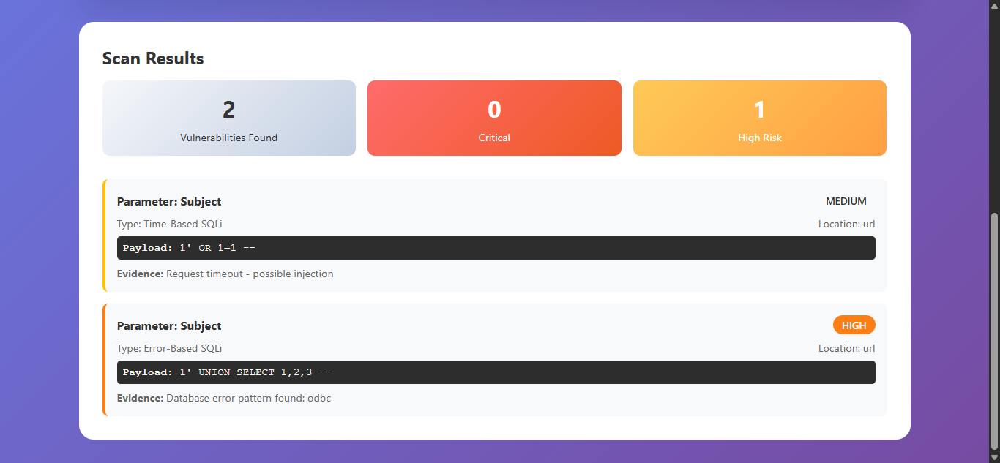

<div align="center">

# 🛡️ SQL Injection Detector
### Developed by Soft Game Studio

*A professional, high-performance web security tool designed to detect SQL injection vulnerabilities across web applications.*

</div>

---

## 🚀 Overview

The **Soft Game Studio SQL Injection Detector** is an advanced security testing framework that automates the discovery of SQL Injection (SQLi) flaws in web applications. By utilizing a comprehensive set of payloads and intelligent response analysis, it accurately identifies Error-based, Time-based, and Boolean-based vulnerabilities, providing a detailed assessment of your application's database security posture.

## 📸 Screenshots

**1. Scan Configuration Interface — URL Input**  


**2. Vulnerability Scan Results — After SQL Query**  


## ✨ Core Technical Features

- **Automated Parameter Scanning**: Systematically extracts and tests all GET parameters in target URLs for potential injection vectors.
- **Deep Crawling Engine**: Optionally traverses internal links using BeautifulSoup to expand the attack surface and discover hidden parameters.
- **Intelligent Response Analysis**: Analyzes HTTP responses for database syntax errors, response length variations, and time delays to pinpoint vulnerabilities.
- **Comprehensive Reporting System**: Generates structured JSON vulnerability reports detailing affected parameters, successful payloads, and severity levels.
- **Modern Web Interface**: Provides a clean, responsive Flask-based UI for configuring scans, monitoring progress, and reviewing security reports.

## 📦 Installation

Ensure you have Python 3.8+ installed. To set up the application and its dependencies:

```bash
# Clone the repository and navigate to the directory
cd "SQL Injection Detector"

# Install required dependencies
pip install -r requirements.txt
```

*(See `requirements.txt` for details on dependencies like Flask, requests, and beautifulsoup4.)*

## 🛠️ Usage Flow

1. Initialize the application server:
   ```bash
   python app.py
   ```
2. Open your web browser and navigate to the local interface, typically at `http://localhost:5000`.
3. Enter the target URL into the scan configuration panel. *⚠️ Ensure you have explicit authorization to test the target.*
4. Select the "Deep Scan" option if you want the engine to crawl for additional linked pages.
5. Initiate the scan and monitor the real-time vulnerability discovery.
6. Once completed, download or view the generated JSON security report from the `reports` directory.

## 📂 Internal Operations & Code Documentation

We believe in maximum transparency and thorough technical documentation. For a full breakdown exposing exactly how components (`app.py`, `backend/scanner.py`, `backend/detectors.py`, `backend/crawler.py`) functionally process targets and analyze vulnerabilities, please refer to our comprehensively updated manual:

👉 **[View Technical Manual - Code & Logic Breakdown](docs/SQL%20Injection%20Detector.md)**

---

<div align="center">

**[Soft Game Studio](https://github.com/SoftGameStudio)**
*Engineering state-of-the-art software systems for scalable enterprise ecosystems.*

</div>